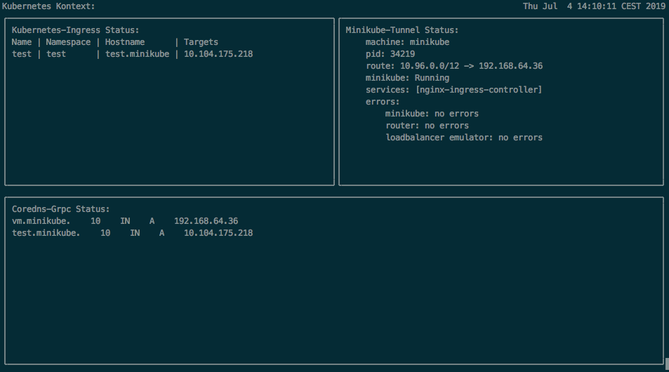

# Minikube Support Tools

The minikube-support tools combines some external and kubernetes internal tools to provide a better interaction between 
minikube and the developers local os.
The main entry point to run everything on the current minikube instance, simply run `minikube-support run`.
It will install and configure if needed

- a local [CoreDNS](https://coredns.io/),
- [mkcert](https://github.com/FiloSottile/mkcert) 
  - including generating a new CA and installing them into the trust stores of your local browsers
- the [Cert-Manager](https://github.com/jetstack/cert-manager)
  - including the fresh generated CA as ClusterIssuer. 
- a [Nginx Ingress Controller](https://kubernetes.github.io/ingress-nginx/) into minikube

and starts

- the `minikube tunnel` command to allow access to all `LoadBalancer` services
- watching the ingresses
- a grpc server that acts as backend for the local CoreDNS instance serving DNS names to all the ingresses and `LoadBalancer` services.

## Usage

Simply run:

```bash 
minikube-support run
```



It also allows to run every tool separate:
```bash
minikube-support run [TOOL]
```

Some of the tools can only run together, like the grpc dns backend and watching the ingresses.

To get an overview about the available runnable tools execute:
```bash
minikube-support run --help
```

### (Un-|Updating)Installing a single tool

The minikube support tools support installing, updating and uninstalling of all tools separate or all together.

Just run one of the following commands:

```bash
# Installing all:
minikube-support install
# Updating all:
minikube-support update
# Uninstalling all:
minikube-support remove

# Installing a single tool:
minikube-support install [TOOL]
# Updating a single tool:
minikube-support update [TOOL]
# Uninstalling a single tool:
minikube-support remove [TOOL]
```


# Installing

## Requirements

The `minikube-support`-Tools requires a supported and preinstalled package manager on the system.
This allows the tools to install the additional helper tools directly using the system's package manger.

Currently the following package managers are supported:

- [**HomeBrew**](https://brew.sh/) (macOS and Linux using [Linuxbrew](https://docs.brew.sh/Homebrew-on-Linux))

## Building from Source

```shell script
git clone https://github.com/qaware/minikube-support.git
make build
```

Then the built binary is located under [`bin`](bin).

## Using prebuilt images

Take a look under [Releases](https://github.com/qaware/minikube-support/releases) and download the prebuilt image for your operating system.

# Contributing

1. Fork it
2. Download your fork to your PC (`git clone https://github.com/your_username/minikube-support && cd minikube-support`)
3. Create your feature branch (`git checkout -b my-new-feature`)
4. Make changes and add them (`git add .`)
5. Commit your changes (`git commit -m 'Add some feature'`)
6. Push to the branch (`git push origin my-new-feature`)
7. Create new pull request

# License

Minikube-Support is released under the MIT license. See [LICENSE](https://github.com/qaware/minikube-support/blob/master/LICENSE)

# Maintainer

Christian Fritz (@chrfritz)